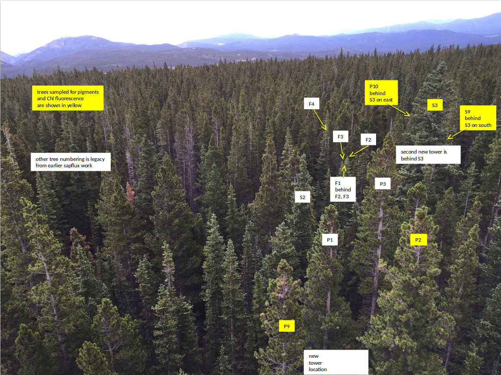

```{r setup, include=FALSE}
knitr::opts_chunk$set(echo = TRUE)
```

## Introduction
In this document we explain the necessary steps and methods to compare pigment data with color-based indices based on digital repeat photography collected from the Niwot Ridge Station in Colorado. The main steps include:

1) Post-processing of pigment data collected at the site, in order to make it easier to analyze 
2) Drawing Regions of Interest (ROI's) on the PhenoCam data to generate greenness time-series data for each individual tree that pigment samples are collected from.
3) Merging the post-processed pigment data with the PhenoCam data
4) Performing basic exploratory analysis 

This document is written in R Markdown as a reproducible project, combining the text and codes.

### Research Question 
The main question that this document is trying to address is: 

__How leaf pigment data are related to color-based vegetation indices as they are observed from digital repeat photography?__


## Data
The post-porcessed pigment data mainly include the following:

- Chlorophyll Pool (µmol/g), listed as *CHL*
- Total Carotenoids/ChlA+ChlB (mol/mol), listed as *CAR_CHL*
- V+A+Z /ChlA+ChlB (mol/mol), listed as *Xan_CyclePool*
- Z+A/V+A+Z, listed as *Xan_CycleConv*


The PhenoCam data include fine resolution (1-day and 3-day) chromatic coordinates (e.g., GCC or RCC) time-series from 2015-2019 as it as collected from the [niwot5 PhenoCam](https://phenocam.sr.unh.edu/webcam/sites/niwot5/). The RCC and GCC components are then used to calculate [green-red vegetation index (GRVI)](https://www.mdpi.com/2072-4292/2/10/2369).

Tree ID's and their locations at the site is shown in the figure below:


PhenoCam data and time series include:

- [P2 Tree](https://phenocam.sr.unh.edu/data/archive/niwot5/ROI/niwot5_EN_1002.html)
- [S3 Tree](https://phenocam.sr.unh.edu/data/archive/niwot5/ROI/niwot5_EN_1006.html)
- [P9 Tree](https://phenocam.sr.unh.edu/data/archive/niwot5/ROI/niwot5_EN_1007.html)

All timseries are obtained from the [PhenoCam Niwot5](https://phenocam.sr.unh.edu/webcam/sites/niwot5/) Site as it is shown below:


## Data Wrangling

Data wrangling steps include

##### **1) Load required R packages**

```{r, required libs, warning=FALSE, tidy=TRUE}
# load main R libraries, should be installed first

# install load phenocamapi
if(!require(phenocamapi, quietly = T, warn.conflicts = F)) {
  install.packages('phenocamapi')
  library(phenocamapi, quietly = T, warn.conflicts = F)
}

# install load data.table
if(!require(data.table, quietly = T, warn.conflicts = F)) {
  install.packages('data.table')
  library(data.table, quietly = T, warn.conflicts = F)
}

# install load lubridate
if(!require(lubridate, quietly = T, warn.conflicts = F)) {
  install.packages('lubridate')
  library(lubridate, quietly = T, warn.conflicts = F)
}

# install load gplots
if(!require(gplots, quietly = T, warn.conflicts = F)){
  install.packages('gplots')
  library(gplots, quietly = T, warn.conflicts = F)
}

# install load fields
if(!require(fields, quietly = T, warn.conflicts = F)){
  install.packages('fields')
  library(fields, quietly = T, warn.conflicts = F)
}

```

##### **2) Load pigments data from the raw format**
```{r}

#load pigments
pigments <- read.csv('data/pigment_data/raw/Copy of Niwot Pigments Modified for GCC comparison 5.30.19.csv', 
                     skip = 2, 
                     colClasses = 'character')

#ignoring the rogue data point 

pigments <- pigments[-152,]
```


##### **3) Organize the raw dataset as a clean data frame**
The raw pigment data should be organized and cleaned in order to be used in the next steps.

```{r, warning=FALSE}
# select main columns from the raw data and convert to a data.table
pigmentsDT <- as.data.table(pigments[!pigments$Sample.ID%in%c('', ' '),
                                     c("Sample.ID", 
                                       "Treatment",
                                       "Tree.Species", 
                                       "Chlorophyll.Pool..µmol.g.",
                                       "Total.Carotenoids.ChlA.ChlB..mol.mol.", 
                                       "V.A.Z..ChlA.ChlB..mol.mol.", 
                                       "Z.A.V.A.Z")])

# convert Sample.ID, Treatment and Tree.Species to character type
pigmentsDT[,Sample.ID:=as.character(Sample.ID)]
pigmentsDT[,Treatment:=as.character(Treatment)]
pigmentsDT[,Tree.Species:=as.character(Tree.Species)]

# convert pigment data to numeric values
pigmentsDT[,Chlorophyll.Pool..µmol.g.:=
             as.numeric(Chlorophyll.Pool..µmol.g.)]

pigmentsDT[,Total.Carotenoids.ChlA.ChlB..mol.mol.:=
             as.numeric(Total.Carotenoids.ChlA.ChlB..mol.mol.)]

pigmentsDT[,V.A.Z..ChlA.ChlB..mol.mol.:=
             as.numeric(V.A.Z..ChlA.ChlB..mol.mol.)]
pigmentsDT[,Z.A.V.A.Z:=as.numeric(Z.A.V.A.Z)]


# extract SampleID, date and Tree.ID from the raw/combined Sample.ID column
pigmentsDT[, Sample.ID:=gsub(pattern = ' ', 
                             replacement = '',
                             x = Sample.ID)]

pigmentsDT[, date := as.Date(paste0('20',
                                    substring(text = Sample.ID,
                                              first = 1,
                                              last = 6)), 
                             format = '%Y%m%d')]

pigmentsDT[, Tree.ID := substring(text = Sample.ID, 
                                  first = 7, 
                                  last = 8)]

pigmentsDT[, SampleID := substring(text = Sample.ID, 
                                   first = 9, 
                                   last = 30)]

# correction for P10
pigmentsDT[grepl(pattern = '^0', SampleID), 
           Tree.ID:=paste0(Tree.ID, '0')]

pigmentsDT[grepl(pattern = '^0', SampleID), 
           SampleID:=gsub(pattern = '^0', 
                          replacement = '', SampleID)]

# display the internal structure of the pigment data
# str(pigmentsDT)
```

##### **4) Obtain the PhenoCam Time-series**
PhenoCam 1-day and 3-day time-series are obtained directly from the server and the get combined into a single data.frame.

```{r, load phenocam}

# load gcc
gcc <- rbind(
  
  data.table(get_pheno_ts(site = 'niwot5', vegType = 'EN', 
                          roiID = 1002, type = '1day'), 
             frequency= '1day', Tree.ID='P2'),
  data.table(get_pheno_ts(site = 'niwot5', vegType = 'EN', 
                          roiID = 1002, type = '3day'), 
             frequency= '3day', Tree.ID='P2'),
  
  data.table(get_pheno_ts(site = 'niwot5', vegType = 'EN', 
                          roiID = 1006, type = '1day'), 
             frequency= '1day', Tree.ID='S3'),
  data.table(get_pheno_ts(site = 'niwot5', vegType = 'EN', 
                          roiID = 1006, type = '3day'), 
             frequency= '3day', Tree.ID='S3'),
  
  data.table(get_pheno_ts(site = 'niwot5', vegType = 'EN', 
                          roiID = 1007, type = '1day'), 
             frequency= '1day', Tree.ID='P9'),
  data.table(get_pheno_ts(site = 'niwot5', vegType = 'EN', 
                          roiID = 1007, type = '3day'), 
             frequency= '3day', Tree.ID='P9')
  
)

# convert the date columne to the Date format
gcc [,date:=as.Date(date)]

# display the internal structure of the gcc data
# str(gcc)


```


##### **5) Combine Pigment and PhenoCam data**
In this step, we extract GCC and RCC value for the sample dates at which the pigment data were collected and then we add those as new columns to the pigment data. Finally, we write the final dataset in a CSV-formatted file.


```{r, mashup}

# add empty columns for GCC and RCC 
pigmentsDT$gcc90_1day <- NA
pigmentsDT$gcc90_3day <- NA

pigmentsDT$rcc90_1day <- NA
pigmentsDT$rcc90_3day <- NA

#mashup
for(i in 1:nrow(pigmentsDT)){
  idate <- pigmentsDT[i,date]
  iTree.ID <- pigmentsDT[i,Tree.ID]
  
  gcc90_1day <- gcc[Tree.ID==iTree.ID&date==idate&frequency=='1day',gcc_90]
  rcc90_1day <- gcc[Tree.ID==iTree.ID&date==idate&frequency=='1day',rcc_90]
  
  gcc90_3day <- gcc[Tree.ID==iTree.ID&date%in%c(idate-1, idate, idate+1)&frequency=='3day',gcc_90]
  rcc90_3day <- gcc[Tree.ID==iTree.ID&date%in%c(idate-1, idate, idate+1)&frequency=='3day',rcc_90]
  
  if(length(gcc90_1day)==1) pigmentsDT$gcc90_1day[i] <- gcc90_1day
  if(length(gcc90_3day)==1) pigmentsDT$gcc90_3day[i] <- gcc90_3day
  
  if(length(rcc90_1day)==1) pigmentsDT$rcc90_1day[i] <- rcc90_1day
  if(length(rcc90_3day)==1) pigmentsDT$rcc90_3day[i] <- rcc90_3day
  
}


# display the internal structure of the pigment data, note the newly added columns
# str(pigmentsDT)

# output the pigment data
write.csv(pigmentsDT, file = 'data/pigment_data/pigmentsDT.csv', row.names = F)

```


##### **6) Creating the daily averaged dataset**
Since there are multiple replicates for pigment data, we averaged over the pigment data in order to have a single value for each date/tree. Note that this is only done for samples collected under the light condition and only for the P2, P9 and S3 trees.

```{r, daily mean}

# caclulate the mean values as they are grouped for each tree and reorder by date.
pigments_mean <- pigmentsDT[Treatment=='L'&Tree.ID%in%c('P2', 'P9', 'S3'),.(Gcc1 = mean(gcc90_1day, na.rm = T), 
                                                                            Gcc3 = mean(gcc90_3day, na.rm = T), 
                                                                            Rcc1 = mean(rcc90_1day, na.rm = T), 
                                                                            Rcc3 = mean(rcc90_3day, na.rm = T), 
                                                                            Chl = mean(Chlorophyll.Pool..µmol.g., na.rm = TRUE),
                                                                            Car_Chl = mean(Total.Carotenoids.ChlA.ChlB..mol.mol., na.rm = TRUE),
                                                                            Xan_CyclePool = mean(V.A.Z..ChlA.ChlB..mol.mol., na.rm = TRUE),
                                                                            Xan_CycleConv = mean(Z.A.V.A.Z, na.rm = TRUE)),
                            .(Tree.ID, date)][order(date)]


# display the internal structure of the pigments_mean data, note the averaged data
# str(pigments_mean)

##filling NA gaps
fill_nas <- function(x, y){
  wNA <- is.na(y)
  apx <- approx(x = x[!wNA], 
                y = y[!wNA], 
                xout = x[wNA])
  y[wNA] <- apx$y
  y
}

pigments_mean[,Gcc1:=fill_nas(date, Gcc1), Tree.ID]
pigments_mean[,Gcc3:=fill_nas(date, Gcc3), Tree.ID]
pigments_mean[,Rcc1:=fill_nas(date, Rcc1), Tree.ID]
pigments_mean[,Rcc3:=fill_nas(date, Rcc3), Tree.ID]

# output the pigments_mean data
write.csv(pigments_mean, file = 'data/pigment_data/pigments_mean.csv', row.names = F)
```


##### **7) Calculate GRVI**
GRVI is calculated from RCC and GCC of the PhenoCam 1-day data

```{r, GRVI}

# calcualte the GRVI
pigments_mean[, GCC:=scale(Gcc1), Tree.ID]
pigments_mean[, RCC:=scale(Rcc1), Tree.ID]
pigments_mean[, GRVI:=(Gcc1-Rcc1)/(Gcc1+Rcc1), ]
pigments_mean[, GRVI3:=(Gcc3-Rcc3)/(Gcc3+Rcc3), ]

```

At this point, we have created a cleaned daily averaged per tree dataset that contains both main pigment elements and PhenoCam data. GRVI 


## Results

We performed a quick exploratory analysis on the final dataset.

```{r, fig.height=6, fig.width=6, dpi=300}


# define colors for each time-series
cols <- c('green', 'darkgreen', 'orange', 'red', 'magenta')

# set the graphics
par(mfcol = c(4,2),
    mar = c(3,5,1,0),
    lwd = 2)

# plot GCC
pigments_mean[Tree.ID=='P2',plot(date, GCC, 
                                 type = 'b', 
                                 col = cols[1], 
                                 bty = 'n', 
                                 ylab ='GCC',
                                 ylim = range(na.rm = T, pigments_mean$GCC))];

pigments_mean[Tree.ID=='P9',lines(date, GCC, 
                                  type = 'b', 
                                  col = cols[1],
                                  lty=2)]

pigments_mean[Tree.ID=='S3',lines(date, GCC, 
                                  type = 'b',
                                  col = cols[1],
                                  lty=3)]

# plot RCC
pigments_mean[Tree.ID=='P2',plot(date, RCC, 
                                 type = 'b', 
                                 col = 'red',
                                 bty = 'n', 
                                 ylab ='RCC',
                                 ylim = range(na.rm = T, pigments_mean$RCC))]

pigments_mean[Tree.ID=='P9',lines(date, RCC, 
                                  type = 'b', 
                                  col = 'red',
                                  lty=2)]

pigments_mean[Tree.ID=='S3',lines(date, RCC, 
                                  type = 'b', 
                                  col = 'red',
                                  lty=3)]

# plot GRVI
pigments_mean[Tree.ID=='P2',plot(date, GRVI, 
                                 type = 'b', 
                                 bty = 'n', 
                                 ylab ='GRVI 1-day',
                                 ylim = range(na.rm = T, pigments_mean$GRVI))]

pigments_mean[Tree.ID=='P9',lines(date, GRVI,
                                  type = 'b' ,
                                  lty=2)]

pigments_mean[Tree.ID=='S3',lines(date, GRVI, 
                                  type = 'b',
                                  lty=3)]

# plot GRVI3
pigments_mean[Tree.ID=='P2',plot(date, GRVI3, 
                                 type = 'b', 
                                 bty = 'n', 
                                 ylab ='GRVI 3-day',
                                 ylim = range(na.rm = T, pigments_mean$GRVI3))]

pigments_mean[Tree.ID=='P9',lines(date, GRVI3,
                                  type = 'b' ,
                                  lty=2)]

pigments_mean[Tree.ID=='S3',lines(date, GRVI3, 
                                  type = 'b',
                                  lty=3)]

# plot CHL
pigments_mean[Tree.ID=='P2',plot(date, Chl, 
                                 type = 'b', 
                                 col = cols[2], 
                                 bty = 'n', 
                                 ylab ='Chl',
                                 ylim = range(na.rm = T, pigments_mean$Chl))]

pigments_mean[Tree.ID=='P9',lines(date, Chl, 
                                  type = 'b', 
                                  col = cols[2],
                                  lty=2)]

pigments_mean[Tree.ID=='S3',lines(date, Chl, 
                                  type = 'b', 
                                  col = cols[2],
                                  lty=3)]

# plot Car_Chl
pigments_mean[Tree.ID=='P2',plot(date, Car_Chl, 
                                 type = 'b',
                                 col = cols[3],
                                 bty = 'n', 
                                 ylab ='Car_Chl',
                                 ylim = range(na.rm = T, pigments_mean$Car_Chl))]

pigments_mean[Tree.ID=='P9',lines(date, Car_Chl, 
                                  type = 'b', 
                                  col = cols[3],
                                  lty=2)]

pigments_mean[Tree.ID=='S3',lines(date, Car_Chl, 
                                  type = 'b', 
                                  col = cols[3],
                                  lty=3)]

# plot Xan_CyclePool
pigments_mean[Tree.ID=='P2',plot(date, Xan_CyclePool, 
                                 type = 'b', 
                                 col = cols[4],
                                 bty = 'n', 
                                 ylab ='Xan_CyclePool',
                                 ylim = range(na.rm = T, pigments_mean$Xan_CyclePool))]

pigments_mean[Tree.ID=='P9',lines(date, Xan_CyclePool, 
                                  type = 'b', 
                                  col = cols[4],
                                  lty=2)]

pigments_mean[Tree.ID=='S3',lines(date, Xan_CyclePool, 
                                  type = 'b',
                                  col = cols[4],
                                  lty=3)]

# plot Xan_CycleConv
pigments_mean[Tree.ID=='P2',plot(date, Xan_CycleConv, 
                                 type = 'b', 
                                 col = cols[5], 
                                 bty = 'n', 
                                 ylab ='Xan_CycleConv',
                                 ylim = range(na.rm = T, pigments_mean$Xan_CycleConv))]

pigments_mean[Tree.ID=='P9',lines(date, Xan_CycleConv,
                                  type = 'b',
                                  col = cols[5],
                                  lty=2)]

pigments_mean[Tree.ID=='S3',lines(date, Xan_CycleConv, 
                                  type = 'b',
                                  col = cols[5],
                                  lty=3)]

# add legend
legend('bottom', 
       xpd = TRUE,
       legend = c('P2', 'P9', 'S3'), 
       lty =1:3, 
       bty = 'n')

```


The correlation values for each tree can be calcuated as follows
```{r, cor}
#for all
R_all <- round(cor(na.omit(pigments_mean[,.(GCC, RCC, GRVI, Chl, Car_Chl, Xan_CyclePool, Xan_CycleConv)])),2)

#for P2
R_P2 <- round(cor(na.omit(pigments_mean[Tree.ID=='P2',.(GCC, RCC, GRVI, Chl, Car_Chl, Xan_CyclePool, Xan_CycleConv)])),2)

#for P9
R_P9 <- round(cor(na.omit(pigments_mean[Tree.ID=='P9',.(GCC, RCC, GRVI, Chl, Car_Chl, Xan_CyclePool, Xan_CycleConv)])),2)

#for S3
R_S3 <- round(cor(na.omit(pigments_mean[Tree.ID=='S3',.(GCC, RCC, GRVI, Chl, Car_Chl, Xan_CyclePool, Xan_CycleConv)])),2)

```

To plot the one-to-one relationships:
```{r, plots, fig.height=8, fig.width=8, dpi=300}
cols <- c('#C42253', '#1C6B89', '#DBD326')
pchs <- c(15, 17, 19)

pigments_mean[Tree.ID=='P2', col :=cols[1]]
pigments_mean[Tree.ID=='P9', col :=cols[2]]
pigments_mean[Tree.ID=='S3', col :=cols[3]]

pigments_mean[Tree.ID=='P2', pch :=pchs[1]]
pigments_mean[Tree.ID=='P9', pch :=pchs[2]]
pigments_mean[Tree.ID=='S3', pch :=pchs[3]]


par(font = 2)
pairs((pigments_mean[,.(GCC, RCC, GRVI, Chl, Car_Chl, Xan_CyclePool, Xan_CycleConv)]),
      lower.panel = NULL, 
      gap = 0, 
      xaxt = 'n',
      yaxt = 'n',
col = pigments_mean$col,
pch = pigments_mean$pch)
par(xpd = TRUE)

legend('bottomleft', col = cols, pch = pchs, legend = c('P2', 'P9', 'S3'), bty= 'n', text.font = 2, cex =2)
```

and their correlations as heat maps:
```{r, heatmaps, fig.height=8, fig.width=8, dpi=300}

rotate <- function(x) t(apply(x, 2, rev))

plotR <- function(rr, 
                  cols = colorRampPalette(c('#e66101', '#f7f7f7', '#5e3c99'))(100), 
                  legend = T,
                  ttl ='',
                  labs = colnames(r),
                  ...){
  
  par(pty='s', 
      xaxt='n',
      yaxt='n', 
      bty='n')
  
  r <- rr
  diag(r) <- NA
  r[upper.tri(r)] <- NA
  r <- rotate(r)
  
  image(r,
        zlim=c(-1,1), 
        col = cols, 
        ... )
  
  n <- ncol(r)
  at0 <- seq(par()$usr[1], par()$usr[2], length.out =  n+1)
  at <- at0[-1]+at0[1]
  
  mtext(text = labs[-n], side = 1, at = (at)[-n], line = 1, cex = .7, font=2)
  mtext(text = labs[-1], side = 2, at = rev(at)[-1], line = 1, cex = .7, font=2)
  
  
  mtext(text = ttl, line = -3, font = 2, cex = 1.5)
  
  
  x <- rep(at, n)
  y <- rep(at, each= n)
  # text(rotate(t(x)), rotate(t(y)), rotate(t(t)), font=2, cex=2)
  
  t <- r
  t <- format(t, nsmall = 2)
  t[rotate(upper.tri(t))] <- NA
  t[t=="   NA"] <- NA
  text(x, y, t, font=2, cex=1)
  
  if(legend){
    par(pty='s', xaxt='s', yaxt='s', bty='o')
    
    image.plot(legend.only=TRUE, 
               zlim= c(-1,1), 
               col = cols,
               smallplot= c(.95, .98, .15, .8),
               axis.args = list(cex.axis = 1.2, 
                                font=2, 
                                at=c(-1, 0, 1)),
               legend.args = list(text= 'R',
                                  side=3,
                                  xpd=T, 
                                  adj=0.5, 
                                  line=1, 
                                  font=2, 
                                  cex=1.2),
               horizontal = F, 
               yaxt='s',
               bty='o', 
               xaxt='s')
  }
}
par(mfrow= c(2,2), 
    oma = c(0, 0, 0, 2),
    mar=c(2,2,0,0))
labs <- c("GCC", "RCC", "GRVI", "Chl", "Car:Chl", "Xpool", "Xcon")
plotR(R_P2, ttl = 'P2', legend = F, labs = labs)
plotR(R_P9, ttl = 'P9', legend = F, labs = labs)
plotR(R_S3, ttl = 'S3', legend = F, labs = labs)
plotR(R_all, ttl = 'Overall', labs = labs)


```

The heatmap plots show the correlation values for 1:1 comparisons of vegetation indices and pigment elements. Both GRVI and GCC expressed high correlation values with xanthophyll conversion cycle (Xcon) and xanthophyll cycle pool (Xpool) for all tress and also overall. 

## Next Steps and Timeline
In the next couple months, we would like to accomplish the  following steps:

- Explore the pigment data for spurious points (we seem to have one in March in P9).
- Explore relationships using mean values of all of the data we have (that is, not confining the analyses to just those trees for which we have pigments in the field of view of the phenocam).
- Consider adding data from the year of study described in Dave et al.'s AFM (2018) article. Noting that those data may not have all of the resolution of the data year we’ve been working with.

